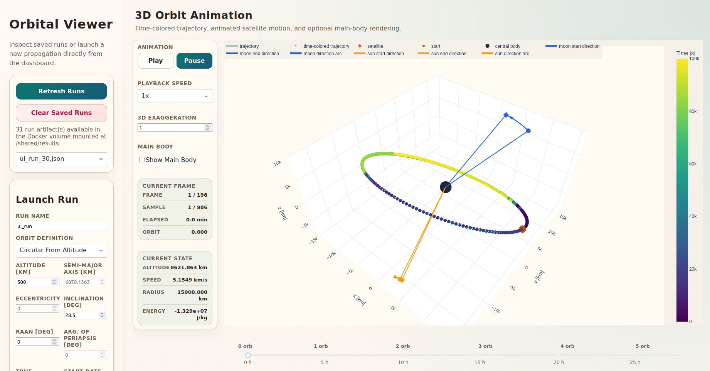

# Orbital Propagator And Visualization Interface

This repository contains two connected parts:

- `orbital_propagator`: a Python orbital propagation package for Earth-centered runs with configurable perturbations.
- `visualization_interface`: a Dash web app for launching runs, browsing saved results, and visualizing trajectories and diagnostics.

Saved run artifacts are written as JSON files into [results](./results), which is bind-mounted into both containers at `/shared/results`.

## What's Inside

### `orbital_propagator`

Main areas:

- `bodies/`: central-body definitions such as Earth constants
- `forces/`: force models
- `ephemerides/`: Sun and Moon position providers
- `propagation/`: dynamics, integrators, orbital elements, and simulation runner
- `io/`: JSON artifact generation and persistence
- `cli.py`: command-line entrypoint

Current force models:

- central gravity
- `J2`, Earth's oblateness
- atmospheric drag with either `piecewise_exponential` or `pymsis`
- Sun third-body gravity
- Moon third-body gravity
- solar radiation pressure

### `visualization_interface`

Main areas:

- `app.py`: Dash app entrypoint and callbacks
- `loaders/`: loading saved run artifacts
- `launchers/`: launching propagations from the UI
- `assets/`: CSS styling

Current UI features:

- launch a new propagation from the browser
- load saved JSON run artifacts
- 3D trajectory view
- exaggerated 3D trajectory view
- acceleration, altitude, speed, energy, and orbital-element plots
- clear saved run artifacts from the app

## Run With Docker

Build once:

```bash
docker compose build
```

### Start The Web App

```bash
docker compose up visualization_interface
```

Then open `http://localhost:8050`.

### Run A Propagation From The CLI

Example:

```bash
docker compose run --rm orbital_propagator \
  --output /shared/results/j2_drag_demo.json \
  --run-name j2_drag_demo \
  --start-epoch-utc 2026-04-23T12:00:00Z \
  --altitude-km 500 \
  --inclination-deg 51.6 \
  --duration-s 5400 \
  --sample-count 721 \
  --enable-j2 \
  --enable-drag \
  --atmosphere-model piecewise_exponential
```

The result will appear in [results](./results).

### Run A Propagation From The Web Interface

1. Start the app with `docker compose up visualization_interface`
2. Open `http://localhost:8050`
3. Fill in the run parameters in the sidebar
4. Click `Run Propagation`
5. Inspect the generated run and plots

The generated JSON artifact is also saved in [results](./results).

## Notes

- The app and the CLI read and write the same artifact format.
- The `results/` folder is now part of the repository workspace, so you can inspect or delete JSON outputs directly.
- If you use `pymsis`, the container must have the required dependency data available at runtime.

## Unified Data-Generation Configuration

Dataset parameter definitions live in the single packaged file
`orbital_propagator/src/orbital_propagator/configs/data_generation.yaml`. It
groups fixed planet and third-body catalogs, spacecraft priors, orbit-family
priors, derived environment rules, dataset recipes, and export defaults.

Central bodies remain propagator-native `CentralBodyConfig` objects. The
adapter in `orbital_propagator/bodies/catalog.py` converts the catalog's
explicit kilometer units to the SI units used by the numerical core. Fixed
planet constants and their provenance links are recorded in the unified YAML.
Mercury and Venus J2 remain null because no directly compatible authoritative
unnormalized value was adopted; requesting J2 for either body fails clearly.

Only Mercury, Venus, Earth, Mars, Jupiter, Saturn, Uranus, and Neptune may be
central bodies. The Moon is absent from that catalog but remains available as
an Earth-only perturbing third body. Drag is initially Earth-only, and solar
radiation pressure uses the catalog heliocentric distance with inverse-square
scaling. Orbit-family conversion and prior sampling are handled by the Phase 7
sampler.

Sample one complete recipe parameter object with a seeded NumPy generator:

```python
import numpy as np

from orbital_propagator.generation.sampling import sample_generation_parameters

sample = sample_generation_parameters(
    "multi_planet_two_body",
    np.random.default_rng(42),
)
```

The returned dictionary includes the selected planet and orbit family,
physical orbital elements, enabled third bodies, force switches, all sampled
spacecraft inputs (`C_D`, `C_R`, and `A_over_m`), and the derived `gamma_D` and
`gamma_R` coefficients.

## Build A Trajectory Dataset From A Manifest

The manifest is a JSON Lines file: every non-empty line is one fully specified
trajectory. Parameters are sampled and validated before any new lines are
appended.

Create or extend a manifest reproducibly:

```bash
docker compose run --rm orbital_propagator manifest recipes

docker compose run --rm orbital_propagator manifest append \
  --manifest /shared/data/manifests/two_body.jsonl \
  --recipe multi_planet_two_body \
  --count 100 \
  --seed 42 \
  --duration-s 5400 \
  --sample-count 181
```

Validate an edited or generated manifest without propagating it:

```bash
docker compose run --rm orbital_propagator manifest validate \
  --manifest /shared/data/manifests/two_body.jsonl
```

Execute every trajectory and retain per-force acceleration arrays:

```bash
docker compose run --rm orbital_propagator manifest build \
  --manifest /shared/data/manifests/two_body.jsonl \
  --output-dir /shared/data/datasets/two_body
```

Use `--skip-existing` on `manifest build` to resume an interrupted build. Use
`manifest --help`, `manifest append --help`, or `manifest build --help` for the
complete command reference. The host files appear under `data/manifests/` and
`data/datasets/`. Commit the small manifest to Git for reproducibility and
version the generated dataset directory with DVC.

## Interface Preview


